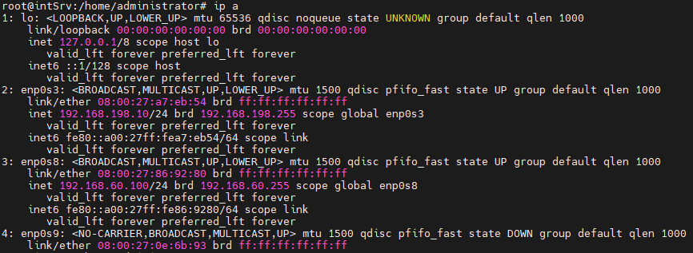

## Indice

- [Indice](#indice)
- [Introduzione](#introduzione)
  - [Informazioni sul progetto](#informazioni-sul-progetto)
  - [Scopo](#scopo)
- [Analisi](#analisi)
  - [Analisi e specifica dei requisiti](#analisi-e-specifica-dei-requisiti)
- [Implementazione](#implementazione)
  - [Configurazione macchine virtuali](#configurazione-macchine-virtuali)
    - [Router](#router)
    - [PC rete interna](#pc-rete-interna)
    - [Webserver](#webserver)
    - [Impostazione proxy](#impostazione-proxy)
    - [Impostazione indirizzo ip](#impostazione-indirizzo-ip)
  - [Installazione e configurazione Apache](#installazione-e-configurazione-apache)
    - [Installazione](#installazione)
    - [Configurazione porte in ascolto](#configurazione-porte-in-ascolto)
  - [Installazione e configurazione IP Tables](#installazione-e-configurazione-ip-tables)
    - [Installazione](#installazione-1)
    - [Mostrare tutte le regole attive](#mostrare-tutte-le-regole-attive)
    - [Default configuration](#default-configuration)
    - [SSH al router](#ssh-al-router)
    - [IP forwarding](#ip-forwarding)
    - [Accesso a internet](#accesso-a-internet)
    - [Port forwarding](#port-forwarding)
    - [Ping dall'interno al router](#ping-dallinterno-al-router)
    - [Regole iptables persistenti](#regole-iptables-persistenti)
- [Test](#test)
  - [Protocollo di test](#protocollo-di-test)
  - [Risultati test](#risultati-test)
- [Conclusioni](#conclusioni)
  - [Considerazioni personali](#considerazioni-personali)
- [Sitografia](#sitografia)

<br>

## Introduzione

### Informazioni sul progetto

 - **Titolo**: Questionario patenti 

 - **Allievi coinvolti nel progetto**:
  
   - Samuel Banfi, <a href="mailto:samuel.banfi@samtrevano.ch">samuelbanfi@samtrevano.ch</a>
  
   - Dennis Donofrio, <a href="mailto:dennis.donofrio@samtrevano.ch">dennis.donofrio@samtrevano.ch</a>

 - **Classe**: I4AC, Scuola Arti e Mestieri Trevano, sezione Informatica

 - **Committente**: Massimo Sartori

 - **Data d'inizio**: 24.10.2022

 - **Data di fine**: 21.11.2022

<br>

### Scopo

Lo scopo del progetto `IP Tables` è quello di utilizzare un server Debian che fa da router e gestsice tutte le richieste in entrata e in uscita. Il Server Debian serve anche per dividere tutto in 2 reti Una interna e una DMZ. Una con indrizzo di rete `192.168.238.0/24` e una con indirizzo di rete `192.168.198.0/24`. Quest'ultima viene utilizzata come DMZ dove mettere il server WEB.

<br>

<div style="text-align:center">
  
</div>

<br>

## Analisi

### Analisi e specifica dei requisiti

<br>

| ID | REQ-001 |
| -------- | - |
| **Nome** | Configurazione VM NET 3 |
| **Priorità** | 1 |
| **Versione** | 1.0 |
| **Note** | Bisogna avere una rete privata con indirizzo di rete `192.168.238.0/24`. <br> Tutti i computer nella rete possono accedere ad internet. <br> Non bisogna accedere dall'esterno. |

<br>

| ID | REQ-002 |
| -------- | - |
| **Nome** | Configurazione Server Apache |
| **Priorità** | 1 |
| **Versione** | 1.0 |
| **Note** | Bisognerà avere un server WEB con installato Apache. <br> Il servizio di Apache dovrà ascoltare sulla porta `443` (HTTPS) e `8080` (interno). <br> Bisognerà poter accedere alla pagina. |

<br>

| ID | REQ-003 |
| -------- | - |
| **Nome** | Configurazione VM NET 4 |
| **Priorità** | 1 |
| **Versione** | 1.0 |
| **Note** | Bisogna avere una rete DMZ con indirizzo di rete `192.168.198.0/24`. <br> Bisogna avere un server WEB al suo interno (REQ-002). <br> Bisogna aprire le connessioni in uscita. <br> Bisogna disabilitare le connessioni in entrata, escluso Apache. <br> Il server deve essere raggiungibile dall'esterno solo tramite l'IP del router. |

<br>

| ID | REQ-004 |
| -------- | - |
| **Nome** | Ping disabilitato |
| **Priorità** | 1 |
| **Versione** | 1.0 |
| **Note** | Il `ping` verso le reti interne deve essere impossibile. |

<br>

| ID | REQ-005 |
| -------- | - |
| **Nome** | Accesso tramite SSH |
| **Priorità** | 1 |
| **Versione** | 1.0 |
| **Note** | Bisogna rendere possibile l'accesso al router tramite `SSH` per la configurazione. |

<br>

| ID | REQ-006 |
| -------- | - |
| **Nome** | Configurazione IP forwarding |
| **Priorità** | 1 |
| **Versione** | 1.0 |
| **Note** | Bisogna abilitare `ip_forwarding` |

<br>

| ID | REQ-007 |
| -------- | - |
| **Nome** | Impostare regole di default per IP Tables |
| **Priorità** | 1 |
| **Versione** | 1.0 |
| **Note** | Bisogna impostare le regole di default in modo da avere `INPUT` e `FORWARD` bloccati. Invece `OUTPUT` deve essere aperto. |

<br>

| ID | REQ-008 |
| -------- | - |
| **Nome** | Salvataggio regole IP Tables |
| **Priorità** | 1 |
| **Versione** | 1.0 |
| **Note** | Bisogna salvare le regole di `iptables`. |

<br>

| ID | REQ-009 |
| -------- | - |
| **Nome** | Caricamento automatico regole IP Tables ad ogni riavvio |
| **Priorità** | 1 |
| **Versione** | 1.0 |
| **Note** | Bisogna fare in modo che le regole di `iptables` vengano caricate automaticamente ad ogni riavvio. |

<br>

**Spiegazione elementi tabella dei requisiti:**

**ID**: identificativo univoco del requisito

**Nome**: breve descrizione del requisito

**Priorità**: indica l’importanza di un requisito nell’insieme del
progetto, definita assieme al committente.

**Versione**: indica la versione del requisito. Ogni modifica del
requisito avrà una versione aggiornata.

Sulla documentazione apparirà solamente l’ultima versione, mentre le
vecchie dovranno essere inserite nei diari.

**Note**: eventuali osservazioni importanti o riferimenti ad altri
requisiti.

<br>

## Implementazione

### Configurazione macchine virtuali

#### Router
Il router è configurato nel seguente modo:

- CPU: 2 core
- RAM: 2 GB
- Rete:
  - `NAT network` DHCP
  - `Internal network` lan (192.168.238.1/24)
  - `Internal network` dmz (192.168.198.1/24)
  - `Host-Only` DHCP
- Sistema operativo: `Debian`

<br>

#### PC rete interna
Il PC della rete interna è configurato nel seguente modo:

- CPU: 2 core
- RAM: 2 GB
- Rete: 
  - `Internal network` lan (192.168.238.10/24, 192.168.238.1)
  - `Host-Only` DHCP
- Sistema operativo: `Debian`

<br>

#### Webserver
Il webserver è configurato nel seguente modo:

- CPU: 2 core
- RAM: 2 GB
- Rete:
  - `Internal network` dmz (192.168.198.10/24, 192.168.198.1)
  - `Host-Only` DHCP
- Sistema operativo: `Debian`

<br>

#### Impostazione proxy
Durante l'installazione di tutte le macchine virtuali bisogna configurare il proxy impostando l'indirizzo `10.0.2.2:5865`. Il proxy serve solamente all'inizio su tutte le macchine per fare la configurazione iniziale e installare tutti gli aggiornamenti necessari. Per utilizzare successivamente il proxy bisogna modificare il file `/etc/environment` e aggiungere le seguenti variabili d'ambiente:

```bash
http_proxy="http://10.0.2.2:5865"
https_proxy="http://10.0.2.2:5865"
HTTP_PROXY="http://10.0.2.2:5865"
HTTPS_PROXY="http://10.0.2.2:5865"
no_proxy=localhost,127.0.0.1
```

L'ultima regola `no_proxy=localhost,127.0.0.1` serve per evitare l'uso del proxy in locale. L'indirizzo ip `10.0.2.2:5865` è quello di `px-py`.<br><br>
Per essere sicuri del funzionamento del proxy si può usare il comando `curl` per farsi ritornare la pagina html perché questo comando deve passare attraverso il proxy. Senza la configurazione di iptables il seguente comando funziona solo per il router.

```bash
curl google.com
```

<br>

#### Impostazione indirizzo ip
Visto che stiamo lavorando su `Debian` per modificare l'indirizzo ip delle macchine bisogna modificare il file `/etc/network/interfaces` aggiungendo le varie schede di rete e impostando gli indirizzi ip (`address`), le subnet mask (`netmask`) e i `gateway`. Bisogna inserire quest'ultimo campo solo se quella determinata scheda di rete serve per uscire su internet.

```bash
auto <interface>
iface <interface> inet static
    address <ip_address>
    netmask <ip_subnet>
    gateway <ip_gateway>
    dns-nameservers 8.8.8.8
```

<br>

### Installazione e configurazione Apache

#### Installazione
Per installare `Apache 2.4` bisogna eseguire l'`update` per aggiornare tutte le librerie. In seguito bisogna eseguire il comando `sudo apt install apache2 -y` per installare Apache. Attenzione, per installare i pacchetti bisogna eseguire le operazioni come `sudo`, ovvero come `superuser`.

```bash
sudo apt update
sudo apt install apache2 -y
```
<br>

#### Configurazione porte in ascolto
Per configurare le porte in ascolto da Apache sul server bisogna modificare il file `/etc/apache2/ports.conf` e aggiungere un `Listen` per la porta `8080`. Non serve aggiungerlo per la porta `443` perché è già presente di default come per la porta 80.

```bash
sudo nano /etc/apache2/ports.conf
```
```bash
Listen 8080
```

<br>

### Installazione e configurazione IP Tables

#### Installazione
Di default `iptables` non è presente su Debian. Quindi va installato tramite `apt`. Una volta installato tutte le regole di default vengono impostate su `accept`.

```bash
sudo apt install iptables -y
```

<br>

#### Mostrare tutte le regole attive
Per mostrare tutte le regole attive con IP Tables bisogna eseguire il comando `sudo iptables` aggiungendo il parametro `-L` per listare tutte le regole. Usando `iptables` vengono mostrate tutte le regole per l'`IPv4`. Se si volessero vedere le regole per `IPv6` bisogna usare il comando `sudo ip6tables -S`

```bash
sudo iptables -L
```

#### Default configuration
Per configurare il router con le impostazioni sicure di default bisogna bloccare tutti i pacchetti in entrata.

```bash
iptables --policy INPUT DROP
iptables --policy FORWARD DROP
```

#### SSH al router
Per potersi collegare al router in ssh bisogna accettare le connessioni ssh all'interfaccia esterna del router.

```bash
iptables -A INPUT -p tcp --dport ssh -j ACCEPT
```

<br>

#### IP forwarding
L'IP forwarding ha lo scopo di eseguire il forwarding dei pacchetti in uscita verso le altre schede di rete. Per abilitarlo in modo permanente bisogna modificare il file `/etc/sysctl.conf`.

```bash
sudo nano /etc/sysctl.conf
```

In seguito bisogna decommentare la seguente riga al file per abilitare l'IP forwarding:

```bash
net.ipv4.ip_forward = 1
```

#### Accesso a internet
Per poter accedere ad internet dalla lan bisogna impostare le regole di nat. Questo serve per cambiare l'ip e la porta di destinazione.

```bash
iptables -t nat -A POSTROUTING -s <rete interna>/<maschera> -o <interfaccia di uscita> -j MASQUERADE
```

Inoltre bisogna accettare tutte le connessioni dalla rete interna verso l'interfaccia in internet.

```bash
iptables -A FORWARD -s <rete interna>/<maschera> -i <interfaccia di uscita> -j ACCEPT
```

Infine bisogna accettare tutte le connessioni in entrata che hanno lo stato `RELATED` o `ESTABLISHED`.

```bash
iptables -A FORWARD -m conntrack --ctstate RELATED,ESTABLISHED -j ACCEPT
```

#### Port forwarding
Per fare il port forwarding dalla porta 443 esterna alla porta 8080 interna bisogna prima cambiare la porta di destinazione.

```bash
iptables -t nat -A PREROUTING -i <interfaccia in entrata> -p tcp --dport 443 -j DNAT --to-destination <ip interno>:8080
```

Inoltre bisogna accettare tutte le connessioni sulla porta 8080.

```bash
iptables -A FORWARD -i <interfaccia in entrata> -p tcp --dport 8080 -j ACCEPT
```

#### Ping dall'interno al router
Per poter effettuare un ping dalla rete interna all'interfaccia del router bisogna accettare le connessioni `ICMP`, ma solo dalla rete interna.

```bash
iptables -A INPUT -i <interfaccia rete interna> -p icmp -j ACCEPT
iptables -A OUTPUT -o <interfaccia rete interna> -p icmp -j ACCEPT
```

#### Regole iptables persistenti
Per rendere le regole di iptables persistenti bisogna installare un pacchetto aggiuntivo.

```bash
sudo apt-get install iptables-persistent
```

<br>

## Test

### Protocollo di test

 | Test Case       | TC-001                               |
 | --------------- | -------------------------------------- |
 | **Nome**        | Test assegnazione IP |
 | **Riferimento** | REQ-001, REQ-003 |
 | **Descrizione** | Controllare che il webserver abbia un indirizzo nella rete `192.168.198.0`. <br> Controllare che il PC di test abbia un indirizzo nella rete `192.168.238.0`. <br> Il router invece deve avere tre schede di rete, una con la rete `10.0.2.0`, una `192.168.198.0` e una `192.168.238.0` |
 | **Prerequisiti** | - |
 | **Procedura** | 1. Aprire le macchine virtuali. <br> 2. Eseguire il comando `ip a`. <br> 3. Controllare l'indirizzo IP con la dicitura `inet`. |
 | **Risultati attesi** | Il webserver ha un indirizzo nella rete `192.168.198.0`. <br> Il PC di test ha un indirizzo nella rete `192.168.238.0`. <br> Il router ha tre schede di rete, una con l'indirizzo di rete `10.0.2.0`, una `192.168.198.0` e una `192.168.238.0` |

 <br>

 | Test Case       | TC-002                               |
 | --------------- | -------------------------------------- |
 | **Nome**        | Connesione PC test ad internet |
 | **Riferimento** | REQ-001 |
 | **Descrizione** | Bisogna verificare che il PC di test nella rete `192.168.238.0` possa accedere ad internet. |
 | **Prerequisiti** | - |
 | **Procedura** | 1. Avviare il PC di test. <br> 2. Eseguire il comando `curl google.com`. |
 | **Risultati attesi** | Viene mostrato il contenuto della pagina HTML di Google. |

 <br>

 | Test Case       | TC-003                               |
 | --------------- | -------------------------------------- |
 | **Nome**        | Funzionamento Apache |
 | **Riferimento** | REQ-002 |
 | **Descrizione** | Bisogna verificare che il servizio di Apache è in ascolto sulla porta 443 (dall'esterno) e sulla 8080 (dall'interno). |
 | **Prerequisiti** | - |
 | **Procedura** | 1. Avviare il PC di test (rete interna). <br> 2. Eseguire il comando `curl 192.168.198.10:8080`. <br> 3. Usare il PC host. <br> 4. Cercare su un browser `localhost:443`. |
 | **Risultati attesi** | Viene mostrato il contenuto della pagina HTML del webserver interno. |

 <br>

 | Test Case       | TC-004                               |
 | --------------- | -------------------------------------- |
 | **Nome**        | Verifica connessioni in entrata disabilitate |
 | **Riferimento** | REQ-003 |
 | **Descrizione** | Bisogna verificare che le connessioni in entrata sono disabilitate, escluso Apache. |
 | **Prerequisiti** | - |
 | **Procedura** | 1. Usare il PC host. <br> 2. Cercare su un browser `192.168.198.10:8080`. <br> 3. Usare il PC host. <br> 4. Cercare su un browser `localhost:443`. |
 | **Risultati attesi** | Nel primo caso la richiesta fallisce. <br> Nel secondo caso invece viene mostrata la pagina HTML del webserver locale. |

 <br>

 | Test Case       | TC-005                               |
 | --------------- | -------------------------------------- |
 | **Nome**        | Verifica ping impossibile verso le reti interne |
 | **Riferimento** | REQ-004 |
 | **Descrizione** | Bisogna verificare che il `ping` verso le reti interne è impossibile. |
 | **Prerequisiti** | - |
 | **Procedura** | 1. Usare il PC host. <br> 2. Eseguire il comando dal terminale `ping 192.168.198.10`. |
 | **Risultati attesi** | I pacchetti inviati con il ping vanno in timeout. |
 
 <br>

 | Test Case       | TC-006                               |
 | --------------- | -------------------------------------- |
 | **Nome**        | Verifica accesso al router tramite SSH |
 | **Riferimento** | REQ-005 |
 | **Descrizione** | Bisogna verificare l'accesso al router tramite `SSH` per la configurazione. |
 | **Prerequisiti** | - |
 | **Procedura** | 1. Usare il PC host. <br> 2. Eseguire il comando dal terminale `ssh administrator@10.0.2.6:2222`. |
 | **Risultati attesi** | Il collegamento SSH avviene correttamente e come utente attuale si vede `administrator`. |
 
 <br>

 | Test Case       | TC-007                               |
 | --------------- | -------------------------------------- |
 | **Nome**        | Verificare regole di default per IP Tables |
 | **Riferimento** | REQ-007 |
 | **Descrizione** | Bisogna verificare che le regole di default siano impostate in modo da avere `INPUT` e `FORWARD` bloccati. Invece `OUTPUT` deve essere aperto. |
 | **Prerequisiti** | - |
 | **Procedura** | 1. Usare il router. <br> 2. Eseguire il comando dal terminale `sudo iptables -S`. |
 | **Risultati attesi** | Il comando mostra `INPUT` e `FORWARD` bloccati. Invece `OUTPUT` risulta aperto. |

 <br>

 | Test Case       | TC-008                               |
 | --------------- | -------------------------------------- |
 | **Nome**        | Veriificare caricamento automatico regole |
 | **Riferimento** | REQ-009 |
 | **Descrizione** | Bisogna verificare che le regole di IP Tables vengano caricate automaticamente ad ogni riavvio. |
 | **Prerequisiti** | REQ-008 |
 | **Procedura** | 1. Usare il router. <br> 2. Caricare le regole di IP Tables. <br> 3. Riavviare il router. <br> 4. Controllare le configurazioni con il comando `iptables -S` |
 | **Risultati attesi** | Vengono mostrate tutte le regole aggiunte in precedenza. |

### Risultati test

 | Test Case | TC-001 |
 | --------- | ------ |
 | Funzionamento | <div style="text-align:center"></div><br><div style="text-align:center"></div><br><div style="text-align:center"></div><br> |
 | Commento | Negli screenshot si vedono le 3 macchine con i rispettivi indirizzi ip. |
 | Data | 26.11.2022 |

 <br>

 | Test Case | TC-002 |
 | --------- | ------ |
 | Funzionamento | <div style="text-align:center"></div> |
 | Commento | Nello screenshot si vede la macchina client che esegue il comando curl verso google.com. |
 | Data | 26.11.2022 |

 <br>

 | Test Case | TC-003 |
 | --------- | ------ |
 | Funzionamento | <div style="text-align:center"></div><br><div style="text-align:center"></div> |
 | Commento | Nel primo screenshot si vede che dalla macchina client si riesce a contattare il webserver nella dmz.<br>Nella seconda immagine si vede che da un browser della macchina host, il nostro internet, si riesce a vedere la pagina del webserver tramite l'ip del router. |
 | Data | 26.11.2022 |

 <br>

 | Test Case | TC-004 |
 | --------- | ------ |
 | Funzionamento | <div style="text-align:center"></div><br><div style="text-align:center"></div> |
 | Commento | Nel primo screenshot si vede la connessione che non può essere stabilita. La causa è che non è possibile arrivare al webserver direttamente con il suo ip.<br>Nel secondo screenshot si vede la connessione stabilita perchè viene chiamato l'ip del router. |
 | Data | 26.11.2022 |

 <br>

 | Test Case | TC-005 |
 | --------- | ------ |
 | Funzionamento | <div style="text-align:center"></div> |
 | Commento | Nello screenshot si vede il tentativo del ping ma non riesce perchè non conosce quella rete. |
 | Data | 26.11.2022 |

 <br>

 | Test Case | TC-006 |
 | --------- | ------ |
 | Funzionamento | <div style="text-align:center"></div> |
 | Commento | Nello screenshot si vede l'accessso effettuato tramite ssh alla porta 2222 dalla macchina host. |
 | Data | 26.11.2022 |
 
 <br>

 | Test Case | TC-007 |
 | --------- | ------ |
 | Funzionamento | <div style="text-align:center"></div> |
 | Commento | Nello screenshot si vede la configurazione delle catene INPUT, FORWARD e OUTPUT. Le prime due sono `DROP` e l'ultima è `ACCEPT`. |
 | Data | 26.11.2022 |
 
 <br>

 | Test Case | TC-008 |
 | --------- | ------ |
 | Funzionamento | <div style="text-align:center"></div><br><div style="text-align:center"></div> |
 | Commento | Nel primo screenshot si vede l'inserimento delle regole in iptables.<br>Nel secondo screenshot si vedono le regole di iptables anche dopo il riavvio. |
 | Data | 26.11.2022 |

 <br>

## Conclusioni

### Considerazioni personali
- Samuel Banfi: A me personalmente è piaciuto molto questo progetto. Mi ha aiutato a capire meglio le funzionalità di Linux, ma soprattutto come rendere sicura una rete da possibili intrusioni esterne. Sono però dell'idea che se avessimo avuto un po' di tempo in più saremmo riusciti a migliorare ancora di più la sicurezza. Credo che questo progetto mi tornerà utile in futuro in una azienda.
  
- Dennis Donofrio: Questo progetto è stato bello ed utile. Mi è piaciuto il fatto di lavorare con un programma molto semplice ma allo stesso tempo molto utile. Inoltre iptables lo si psuò utilizzare su qualsiasi macchina linux e non serve per forza usarlo come router. Una cosa che abbiamo notato è che non è installato di default su tutte le macchine linux. Su debian bisogna installarlo manualmente, come la maggior parte dei programmi di base, come il comando `sudo`. Mi sono trovato molto bene a lavorare in gruppo perchè siamo riusciti a dividerci i compiti. Questo ha reso il tutto più semplice.

## Sitografia
 - [moodle.edu.ti.ch](https://moodle.edu.ti.ch/cpt), Data ultima visita: 26.11.2022
 - [stackoverflow.com](https://stackoverflow.com), Data ultima visita: 25.11.2022